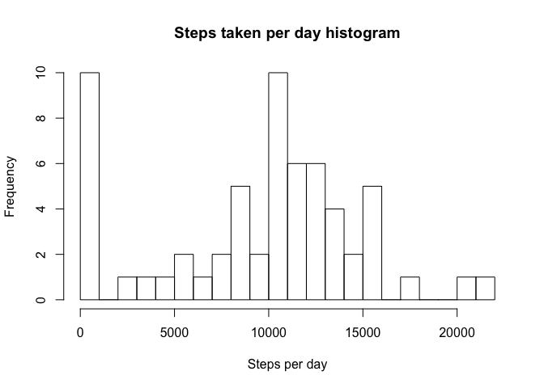
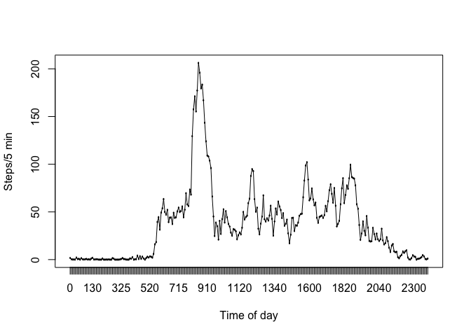
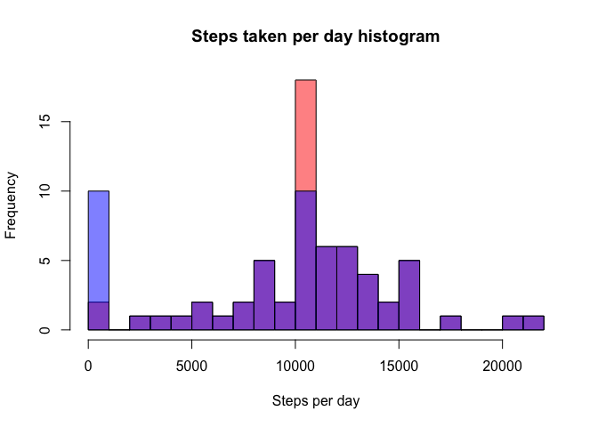
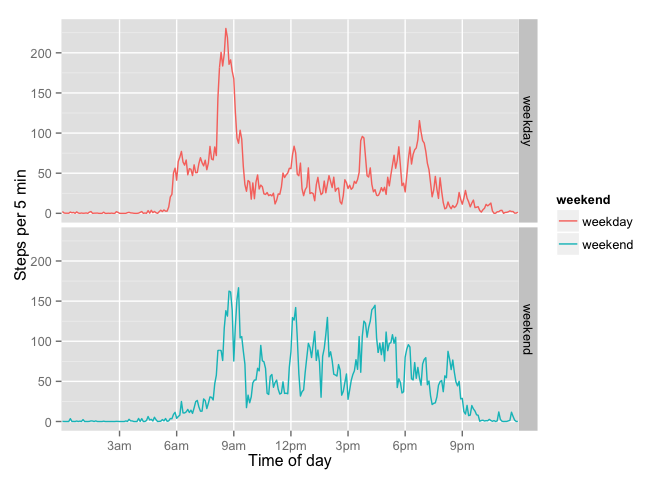

# Reproducible Research: Peer Assessment 1


## Loading and preprocessing the data

The data comes in the CSV format, with headers and no extra lines at the top or the bottom, and so can be loaded with read.csv() with default options.


```r
df<-read.csv("activity.csv")
library("dplyr")
```

```
## 
## Attaching package: 'dplyr'
## 
## The following object is masked from 'package:stats':
## 
##     filter
## 
## The following objects are masked from 'package:base':
## 
##     intersect, setdiff, setequal, union
```

## What is mean total number of steps taken per day?
Using dplyr package, we group the data by date and summarize within the date. Then make the histogram, calculate mean and median number of steps per day.

```r
perday<-summarise(group_by(df,date),stepsperday=sum(steps,na.rm=TRUE))
hist(perday$stepsperday, breaks=20, main='Steps taken per day histogram',xlab='Steps per day')
```

 

```r
mean(perday$stepsperday,na.rm=TRUE)
```

```
## [1] 9354.23
```

```r
median(perday$stepsperday,na.rm=TRUE)
```

```
## [1] 10395
```


## What is the average daily activity pattern?
We group data by interval and find mean over all days. The interval denoted as HMM

```r
byint<-summarise(group_by(df,interval),steps=mean(steps,na.rm=TRUE))
plot(steps ~ factor(interval),data=byint,type='l',xlab='Time of day',ylab='Steps/5 min')
lines(steps ~ factor(interval),data=byint,type='l')
```

 

```r
ts<-byint$interval[which.max(byint$steps)]
```
Let's print the timestamp for the interval with the maximal activity

```r
paste0((ts %/% 100),":",(ts %% 100))
```

```
## [1] "8:35"
```


## Imputing missing values
The total number of missing values of "step" variable would be

```r
nmis<-sum((is.na(df$steps)))
nmis
```

```
## [1] 2304
```
Let us fill in the missing values with the averages for the interval over the other days. We create a new field "avintsteps" which contains average (over the data) number steps taking in this interval, and a new field "filledsteps" which contains either the number of steps (when it is not missing) or the average (when it is missing)

```r
df<-df %>% 
  group_by(interval) %>% 
  mutate(avintsteps=mean(steps,na.rm=TRUE),filledsteps=ifelse(is.na(steps),avintsteps,steps)) %>%
  ungroup()
```
Now we plot histogram of steps taken per day (and calculate mean and median) and compare these with the results reported above, before the missing values were filled in. The red histogram has the values filled in. The blue one has all missed values removed. Overlapping histograms look purple.


```r
perday<-summarise(group_by(df,date),stepsperday=sum(steps,na.rm=TRUE))
perday1<-summarise(group_by(df,date),stepsperday=sum(filledsteps,na.rm=TRUE))
perday2<-summarise(group_by(df,date),stepsperday=sum(steps,na.rm=FALSE))
hist(perday1$stepsperday, breaks=20,col=rgb(1,0,0,0.5), main='Steps taken per day histogram',xlab='Steps per day')
hist(perday$stepsperday, breaks=20,col=rgb(0,0,1,0.5), add=T)
```

 

```r
#hist(perday2$stepsperday, breaks=20,col=rgb(0,1,0,0.5), add=T)
fmean<-mean(perday1$stepsperday,na.rm=TRUE);fmeanprint<-format(fmean,scientific=FALSE)
nfmean<-mean(perday$stepsperday,na.rm=TRUE)
fmean;nfmean
```

```
## [1] 10766.19
```

```
## [1] 9354.23
```

```r
median(perday1$stepsperday,na.rm=TRUE);median(perday$stepsperday,na.rm=TRUE)
```

```
## [1] 10766.19
```

```
## [1] 10395
```

```r
mean2<-format(mean(perday2$stepsperday,na.rm=TRUE),scientific=FALSE);
median2<-median(perday2$stepsperday,na.rm=TRUE)
```
We see that missing values were mainly for the whole days, so removing them inflated number of days with zero steps taken. Imputing the numbers of steps with average values moved all of these days to the bin that has average number of steps per day over the data, 10766.19. If we neither removed the missing data, nor imputed it, we would not get these values in neither of the bins, and the histograms would look like the purple overlapped (which can be checked by uncommenting the line for perday2 histogram), and the mean and median would me 10766.19 and 10765 respectively.


## Are there differences in activity patterns between weekdays and weekends?
We create a new variable, based on the name of the day of the week, factorize it and change name. Then we summarize the data group by interval and type of the day. We see that weekend pattern is somewhat different from workday.

```r
df<-df %>%
  mutate(weekend=factor((weekdays(as.POSIXct(date))=="Sunday" | weekdays(as.POSIXct(date))=="Saturday")))
levels(df$weekend)=c('weekday','weekend')
pattern<- df %>% group_by(interval,weekend) %>% summarize(intsteps=mean(filledsteps))
library(ggplot2)
p<-ggplot(pattern, aes(factor(interval),intsteps,color=weekend))
p<-p + geom_path(aes(group=weekend)) + facet_grid(weekend ~ .)
p + scale_x_discrete(breaks=seq(300,2100,300), labels=c('3am','6am','9am','12pm','3pm','6pm','9pm'),name="Time of day") + ylab("Steps per 5 min")
```

 
